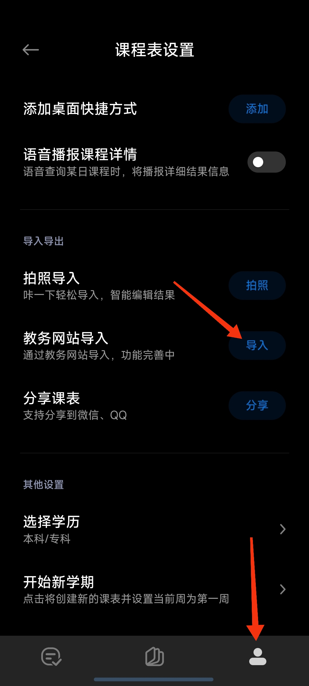
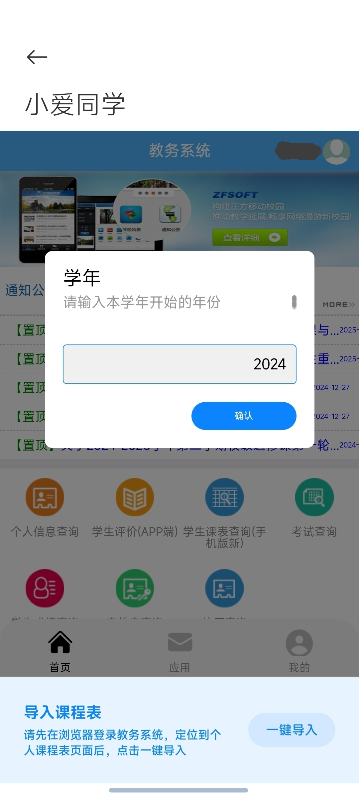
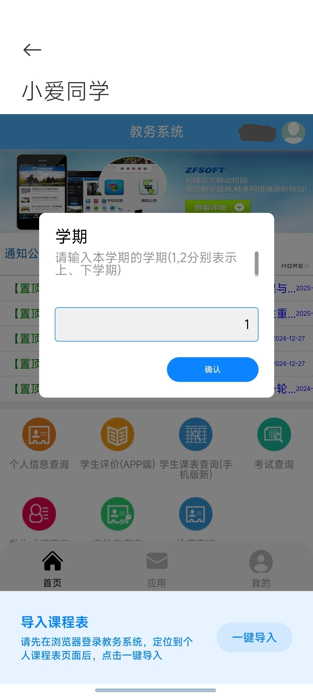

# HYPT-ClassSchedule-ImportTool
用于小爱课程表导入，对于河源职业技术学院进行了适配
#### 有问题就开个issue，我看到的话应该会回复的
#### 对于无法使用小爱同学的，doc文件夹里有小爱课程表的安装包
## 操作步骤示例
###### 简单写了点，不是很会写

  
step1 打开小爱课程表，点击下边第三个图标，再找到“教务网站导入”

  

  
step2 学校选择河源职业技术学院，然后点“适配项目”

  

  
step3 选择图上的项目，然后会回到第二步的界面，现在点击“开始导入”

  

  
step4 如图，登录。不需要勾选“7天免登录”

  

  
step5 找到“业务直通车”下的“新教务系统”，打开

  

  
step6 在这个界面后，点击屏幕下方的“一键导入”

  

  
step7 输入学年，如：2024年9月和2025年2月开学的 属于2024学年

  

  
step8 输入学期，1是上学期（9月开学）2是下学期（2月开学）

  

## 参考
https://open-schedule-prod.ai.xiaomi.com/docs/#/help/

https://zhul.in/2024/11/18/mi-ai-class-schedule-adapter-for-zjut/
